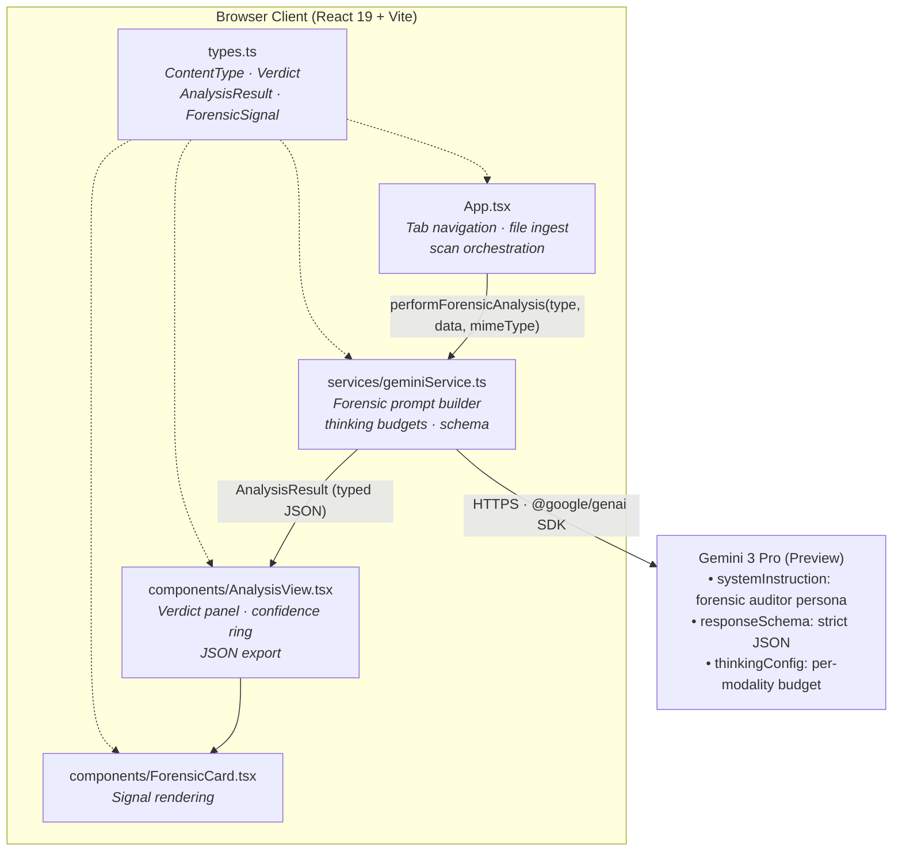
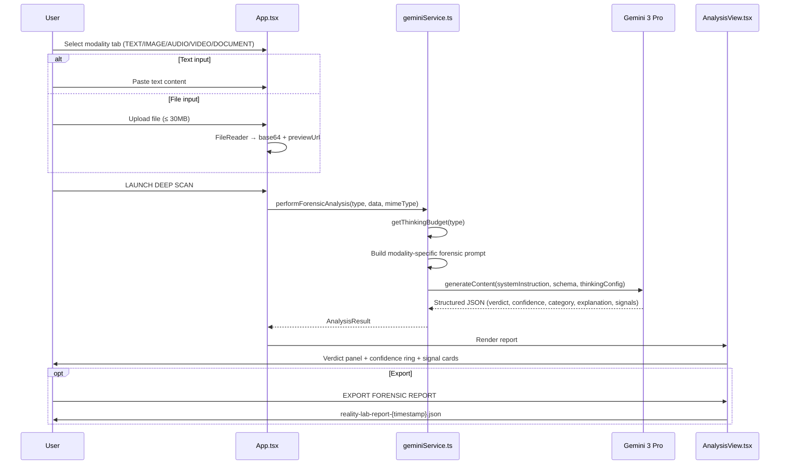
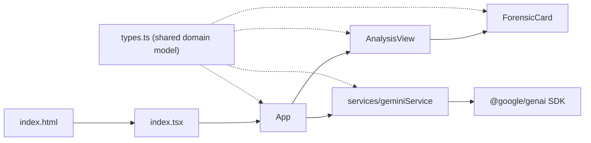

# Reality Lab

**Neural Forensic Attribution Platform** — a multimodal AI-content detection and forensic analysis suite built with React 19, TypeScript, Vite, and Google's Gemini 3 Pro.


---

## 🚀 Overview

**Reality Lab** is a forensic analysis platform that performs deep multimodal inspection of **text, images, audio, video, and documents** to attribute their origin. Rather than returning a simple binary answer, the system acts as a *Neural Forensic Auditor*: every scan produces a structured, schema-enforced forensic report containing a verdict, a confidence score, an origin category, a technical explanation, and a set of weighted detection signals.

The platform distinguishes between:

- **Full-AI content** — total generation (Sora, Flux.1, GPT-4, Midjourney class outputs)
- **Semi-AI (edited) content** — generative-fill seams, AI-upscaling artifacts, mismatched pixel noise at edit boundaries
- **3D / CGI characters** — manual CGI renders (perfect polygons, ray-traced shadows) vs. neural avatars (texture swimming, non-Euclidean geometry)
- **Human-authored content** — natural burstiness, stochastic noise, and physical consistency

---

## ✨ Features

- **Five Analysis Channels** — Text, Image, Audio, Video, and Document (PDF/DOC/DOCX) forensic scanning
- **Adaptive Thinking Budgets** — reasoning-token allocation scales with modality complexity (Video: 24,576 → Audio: 16,000 → Image: 12,000 → Document: 10,000 → Text: 6,000)
- **Schema-Enforced Output** — Gemini responses constrained by a strict `responseSchema` guaranteeing typed `AnalysisResult` JSON
- **Forensic Signal Cards** — each detection signal is labeled, described, and intensity-rated (`LOW` / `MEDIUM` / `HIGH`)
- **Confidence Ring Visualization** — animated SVG radial gauge rendering the model's confidence percentage
- **Exportable Reports** — one-click download of timestamped forensic reports as `.json`
- **Featured Investigation Mode** — built-in benchmark case viewer (embedded social-media stream) for calibrating against real-world multimodal content
- **30MB Deep-Scan Threshold** — client-side file size guard with in-browser base64 preprocessing
- **Self-Hostable** — ships with a multi-stage `Dockerfile` and `docker-compose.yml`

---

## 🏗️ Architecture / How It Works

### System Overview



### Request Lifecycle



### Component Structure



### Forensic Pipeline Detail

1. **Input capture (`App.tsx`)** — The user selects one of five modality tabs. Text is captured directly in a textarea; binary files are read via the browser `FileReader` API, converted to base64, validated against a 30MB threshold, and held in an `UploadedFile` object with a local `previewUrl`.
2. **Forensic dispatch (`services/geminiService.ts`)** — `performForensicAnalysis` constructs a modality-specific user prompt:
   - **Video** → inter-frame motion vectors, deepfake warp-masks, lighting-source persistence
   - **Audio** → phase-alignment errors, frequency-response flattening, voice-cloning jitter
   - **Image** → stochastic noise distribution, 3D texture vs. neural texture, generative-fill seam audit
   - **Document** → metadata inconsistencies, semantic uniformity, AI-specific layout logic
   - **Text** → burstiness metrics, perplexity variance, model-bias markers
3. **Budget allocation** — `getThinkingBudget()` maps each `ContentType` to a reasoning-token budget, giving heavier modalities deeper temporal/deepfake auditing capacity.
4. **Structured inference** — The request is sent to `gemini-3-pro-preview` with a forensic-auditor `systemInstruction`, `responseMimeType: "application/json"`, and a `responseSchema` enforcing the `AnalysisResult` contract: `verdict` (`HUMAN` / `LIKELY_AI` / `UNCERTAIN`), `confidence` (0–100), `category`, `explanation`, and `signals[]`.
5. **Report rendering (`AnalysisView.tsx`)** — Results are visualized with a color-coded verdict panel (emerald / rose / amber), an animated SVG confidence ring (stroke-dashoffset transition), a forensic summary, and a grid of `ForensicCard` components. Reports can be exported as timestamped JSON.

### Key Modules

| File | Responsibility |
|---|---|
| `App.tsx` | Application shell, modality tabs, file ingest, scan orchestration, featured-investigation embed |
| `services/geminiService.ts` | Gemini client, forensic prompt construction, thinking budgets, schema enforcement |
| `components/AnalysisView.tsx` | Verdict dashboard, confidence ring, report export handler |
| `components/ForensicCard.tsx` | Individual detection-signal rendering with intensity badges |
| `types.ts` | Shared domain types (`ContentType`, `Verdict`, `ForensicSignal`, `AnalysisResult`, `UploadedFile`) |
| `vite.config.ts` | Dev server (port 3000, host `0.0.0.0`), `GEMINI_API_KEY` env injection, `@` path alias |

---

## 🛠️ Prerequisites

- **Node.js 18+** and **npm** (or Docker — see below)
- A **Google Gemini API key** with access to `gemini-3-pro-preview` (obtainable from [Google AI Studio](https://aistudio.google.com/))

---

## 📦 Installation

```bash
git clone https://github.com/Shivay00001/Reality-Lab.git
cd Reality-Lab
npm install
```

Create a `.env` file in the project root:

```bash
GEMINI_API_KEY=your_gemini_api_key_here
```

`vite.config.ts` injects this variable into the client bundle as `process.env.API_KEY` / `process.env.GEMINI_API_KEY` at build/dev time.

---

## 💻 Usage

**Development server:**

```bash
npm run dev
# → http://localhost:3000
```

**Production build & preview:**

```bash
npm run build
npm run preview
```

**Workflow:**

1. Select a modality tab — `TEXT`, `IMAGE`, `AUDIO`, `VIDEO`, or `DOCUMENT`.
2. Paste text, or upload a file (≤ 30MB; documents accept `.pdf`, `.doc`, `.docx`, `.txt`).
3. Click **LAUNCH DEEP SCAN** — a scanner animation runs while Gemini performs the forensic audit.
4. Review the verdict, confidence score, origin category, forensic summary, and detection signals.
5. **Export Forensic Report** as JSON, or start a **New Investigation**.

---

## 🐳 Running with Docker

The repository ships with a multi-stage `Dockerfile` (Node 18 Alpine: build stage → production stage) and a `docker-compose.yml`, so it runs identically on any laptop or server.

**Option A — Docker Compose (recommended):**

```bash
docker-compose up --build
```

Then open **http://localhost:8091** — host port `8091` maps to container port `3000` (the Vite server port configured in `vite.config.ts`).

**Option B — Plain Docker:**

```bash
docker build -t reality-lab .
docker run -p 8091:3000 reality-lab
```

**Providing the API key to the container:**

```bash
docker run -p 8091:3000 -e GEMINI_API_KEY=your_key_here reality-lab
```

or add it under `environment:` in `docker-compose.yml`. Because Vite injects the key at **build time** via `define`, ensure `GEMINI_API_KEY` is present in the environment (or `.env`) when the image/bundle is built.

---

## 🤝 Contributing

Contributions, issues, and feature requests are welcome. Please ensure any pull request preserves the forensic output schema (`AnalysisResult`) so the reporting UI remains compatible.

---

## 📝 License

Distributed under the **VisionQuantech Custom Commercial License** (see `LICENSE`):

- **Non-financial / personal / educational use:** Free.
- **Individual revenue-generating use:** Requires a 15–30% revenue share.
- **Business / enterprise use:** Requires a separate commercial license — contact **visionquantech@proton.me**.

THE SOFTWARE IS PROVIDED "AS IS", WITHOUT WARRANTY OF ANY KIND.